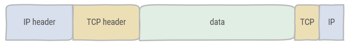

# Ethernet

[Network](https://os.mbed.com/docs/mbed-os/v6.3/apis/connectivity-architecture.html) communication can be represented by the OSI model. Ethernet is an example of a wired communication network protocol, which may cover multiple layers in the OSI model. In the mbed OS library, the [Ethernet](https://os.mbed.com/docs/mbed-os/v6.3/apis/ethernet.html) class refers to OSI layers 1 to 3. So this includes everything up and to IPv4.

Sockets are used in the OSI model on layer 4. TCP and UDP protocols are supported. A socket binds to a certain port number. The combination of an IP address with a port provides an interface to which data can be sent to or received from.

Further OSI model layers are not provided in Mbed OS. These are considered as application specific. Of course it is possible to adhere to protocols such as HTTP, CoAP or MQTT. It is also possible to define an application specific protocol.

## A simple peer-to-peer protocol example

Implementing a simple protocol on top of TCP/IP comes down to defining a data format. The basic connectivity and sending data or receiving data is covered by the TCP/IP stack. Data, which will be defined in our own protocol, is encapsulated in the TCP/IP headers.

Our simple protocol will define what is to be expected in the data of this packet.

* Temperature: 2 bytes 11-bit two-complement's data with a resolution of 0,125°C
* PWM value: 1 byte value range 0-255
* ID sender: 1 byte value range 1-254

Every node, a [FRDM K64F](https://os.mbed.com/platforms/FRDM-K64F/) with [application shield](https://os.mbed.com/components/mbed-Application-Shield/), in the network has a fixed IPv4 address. This address corresponds with the template 192.168.0.xxx, where xxx is the id of the mbed FRDM-K64F box. This ID will also be used to identify the sender.

When starting each node should be configured as a receiver or a sender. This selection is made with the joystick. When selected as a sender in a next step the id of the receiver is selected.

The temperature will be read from the sender, which has an LM75B temperature sensor.

The PWM value should be read from a potentiometer from the sender.

Upon receiving a packet the receiver will display the temperature on the C12832 display and use the PWM value to drive the RGB LED. The duty cycle should correspond linearly to the PWM value.

## Round-robin communication

In round-robin communication each node (whether it is a sender or receiver) will select a receiver ID. In receiver mode, the packet is only sent after the node has received a packet. Append the sender ID to each packet. If the packet contains the ID of the node which has received the packet, communication should stop.

